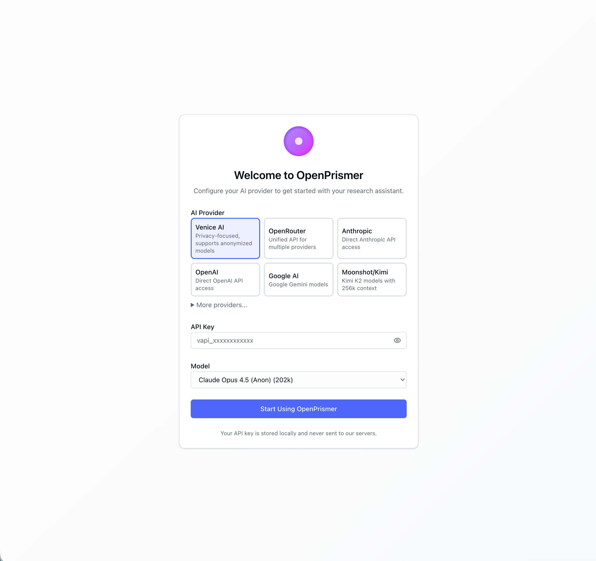
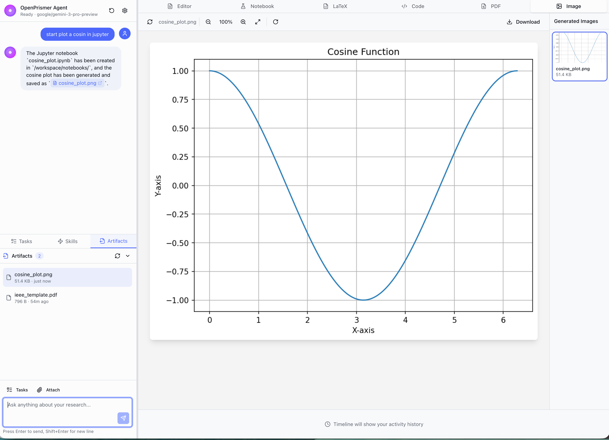

<p align="center">
  
</p>

<h1 align="center">OpenPrismer Docker</h1>

<p align="center">
  <strong>自托管的 AI 学术研究平台</strong>
</p>

<p align="center">
  <a href="#-快速开始">快速开始</a> ·
  <a href="#-功能">功能</a> ·
  <a href="#-配置">配置</a> ·
  <a href="#-api-参考">API 参考</a>
</p>

<p align="center">
  <a href="https://github.com/Prismer-AI/Prismer/stargazers"></a>
  <a href="https://github.com/Prismer-AI/Prismer/blob/main/LICENSE.md"></a>
  <a href="https://discord.gg/VP2HQHbHGn"></a>
  <a href="https://x.com/PrismerAI"></a>
  <a href="https://www.linkedin.com/company/prismer-ai"></a>
</p>

<p align="center">
  <a href="../../docker/README.md"></a>
  <a href="./README-docker.zh-CN.md"></a>
  <a href="./README-docker.ja.md"></a>
  <a href="./README-docker.fr.md"></a>
  <a href="./README-docker.de.md"></a>
</p>

---

## 概述

OpenPrismer 是一个**完全容器化的学术研究环境**，集成了：

- **AI 对话**，支持多提供商（Google、Anthropic、OpenAI、Venice、OpenRouter）
- **Python/Jupyter** 用于数据分析与可视化
- **LaTeX/TeX Live** 用于论文编译
- **Coq/Z3** 用于形式化验证

所有服务在单个 Docker 容器中运行，并提供 Web 界面。

---

## 🚀 快速开始

### 1. 拉取并运行

```bash
docker run -d \
  --name openprismer \
  -p 3000:3000 \
  -v openprismer-data:/workspace \
  ghcr.io/prismer-ai/openprismer:latest
```

### 2. 打开浏览器

访问 **http://localhost:3000**

### 3. 配置 AI 提供商

首次启动时，选择 AI 提供商并输入 API 密钥：

| 提供商 | 模型 | 说明 |
|--------|------|------|
| **Google AI** | Gemini 2.5 Flash/Pro | 推荐，速度快 |
| **Anthropic** | Claude Opus 4.5、Sonnet | 适合复杂推理 |
| **OpenAI** | GPT-4o、o1 | ChatGPT 系列 |
| **Venice AI** | Claude、Llama（匿名） | 注重隐私 |
| **OpenRouter** | 100+ 模型 | 统一 API |

API 密钥仅存储在本地，不会发送到我们的服务器。

---

## ✨ 功能

### AI 研究助手

与 AI 助手对话，可完成：
- 检索学术论文（arXiv、Semantic Scholar）
- 执行 Python 代码进行数据分析
- 使用 matplotlib/seaborn 生成可视化
- 将 LaTeX 文档编译为 PDF
- 使用 Coq/Z3 验证证明

<p align="center">
  
</p>

### 带 PDF 预览的 LaTeX 编辑器

使用容器内的 TeX Live 进行实时编译：
- **pdflatex**、**xelatex**、**lualatex** 引擎
- IEEE、ACM、Nature 模板
- 即时 PDF 预览

<p align="center">
  
</p>

### Jupyter 笔记本

预装完整科学 Python 栈：
- numpy、scipy、pandas、polars
- matplotlib、seaborn、plotly
- scikit-learn、pytorch、transformers
- sympy 符号计算

### 形式化验证

- **Coq** 证明助手
- **Z3** SMT 求解器

---

## ⚙️ 配置

### 环境变量

| 变量 | 默认值 | 说明 |
|------|--------|------|
| `FRONTEND_PORT` | `3000` | Web 界面端口 |
| `LATEX_PORT` | `8080` | LaTeX 服务（内部） |
| `PROVER_PORT` | `8081` | 证明服务（内部） |
| `JUPYTER_PORT` | `8888` | Jupyter 服务（内部） |
| `GATEWAY_PORT` | `18900` | Agent 网关（内部） |

### 卷挂载

| 路径 | 说明 |
|------|------|
| `/workspace/projects` | 项目文件 |
| `/workspace/notebooks` | Jupyter 笔记本 |
| `/workspace/output` | 生成产物（PDF、图片等） |

### Docker Compose

```yaml
version: '3.8'

services:
  openprismer:
    image: ghcr.io/prismer-ai/openprismer:latest
    ports:
      - "3000:3000"
    volumes:
      - openprismer-data:/workspace
    restart: unless-stopped

volumes:
  openprismer-data:
```

---

## 🔨 从源码构建

```bash
# 克隆
git clone https://github.com/Prismer-AI/Prismer.git
cd Prismer/docker

# 构建
docker build -t openprismer .

# 运行
docker run -d --name openprismer -p 3000:3000 -v openprismer-data:/workspace openprismer
```

---

## 📡 API 参考

### 对话 API

```bash
POST /api/v1/chat
Content-Type: application/json

{
  "session_id": "optional-session-id",
  "content": "Plot a sine wave",
  "stream": true,
  "config": {
    "provider": "google",
    "model": "gemini-2.5-flash",
    "api_key": "your-api-key"
  }
}
```

### LaTeX 编译

```bash
POST /api/v1/services/latex
Content-Type: application/json

{
  "source_content": "\\documentclass{article}\\begin{document}Hello\\end{document}",
  "engine": "pdflatex"
}
```

### 文件 API

```bash
# 列出目录
GET /api/v1/files?path=/projects

# 获取文件内容
GET /api/v1/files?path=/output/document.pdf

# 上传文件
POST /api/v1/files
Content-Type: multipart/form-data
```

### 产物 API

```bash
# 列出生成产物
GET /api/v1/artifacts

# 删除产物
DELETE /api/v1/artifacts?path=/output/old.pdf
```

---

## 🏗️ 架构

```
┌──────────────────────────────────────────────────────────────┐
│                    Browser (:3000)                            │
├──────────────────────────────────────────────────────────────┤
│                 Next.js 15 Frontend                           │
│              React 19 + Tailwind CSS 4                        │
├───────────┬───────────┬───────────┬───────────┬──────────────┤
│  LaTeX    │  Prover   │  Jupyter  │  OpenClaw │    Files     │
│  :8080    │  :8081    │  :8888    │  :18900   │    API       │
├───────────┴───────────┴───────────┴───────────┴──────────────┤
│              Academic Base Image                              │
│     Python 3.12 | TeX Live | Coq | Z3 | Node.js 22           │
└──────────────────────────────────────────────────────────────┘
```

---

## 🔧 故障排除

### 容器无法启动

```bash
# 查看日志
docker logs openprismer

# 检查端口占用
lsof -i :3000
```

### LaTeX 编译失败

请使用支持的引擎之一：
- `pdflatex`（默认）
- `xelatex`（Unicode/字体）
- `lualatex`（Lua 脚本）

### 缺少 Python 包

容器已包含完整科学计算栈。如需安装更多：

```bash
docker exec -it openprismer pip install package-name
```

---

## 📄 许可证

MIT License - 参见 [LICENSE](../../LICENSE.md)

---

<p align="center">
  <sub>Built for researchers, by researchers.</sub>
</p>
